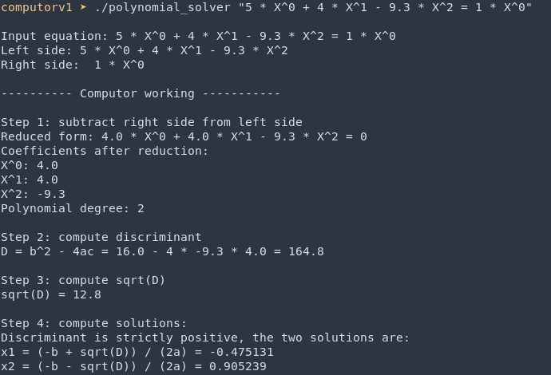
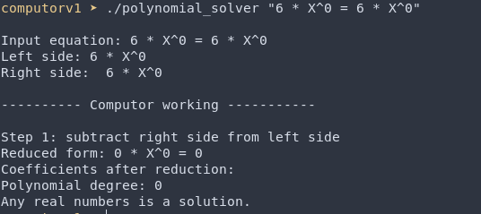
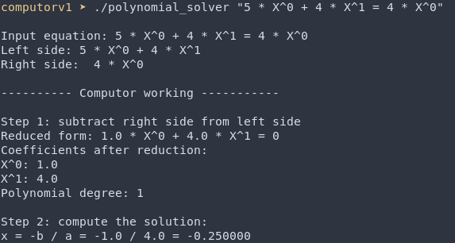

# Polynomial Solver

A simple C++ program that parses and solves polynomial equations of degree ≤ 2.
It supports equations in the format:

``5 * X^0 + 4 * X^1 - 9.3 * X^2 = 1 * X^0``

The program reduces the polynomial, computes the degree, and outputs the solution(s).
It also optionally displays intermediate steps, including coefficient extraction and discriminant calculation.

## Features

- Supports polynomial equations up to degree 2

- Automatically reduces equations to the form 0 = 0

- Solves linear and quadratic equations

- Handles positive, zero, and negative discriminants (including complex solutions)

- Displays intermediate calculation steps for clarity

## Requirements

- C++ compiler supporting C++11 or newer

- <bits/stdc++.h>

## Usage

``./polynomial_solver "<euqation to solve>"``

## Example Output

Degree 2, real solutions

Degree 2, complex solutions

Linear equation

